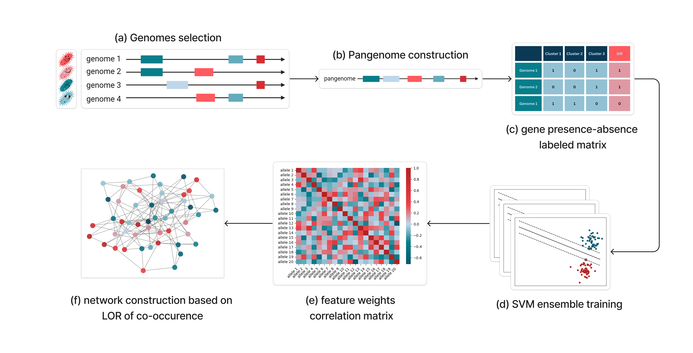
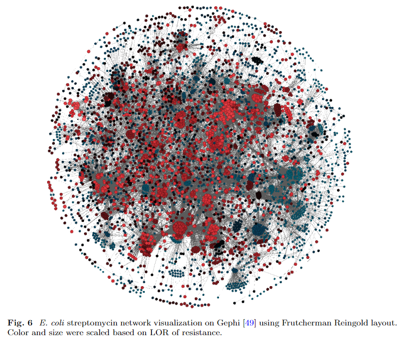
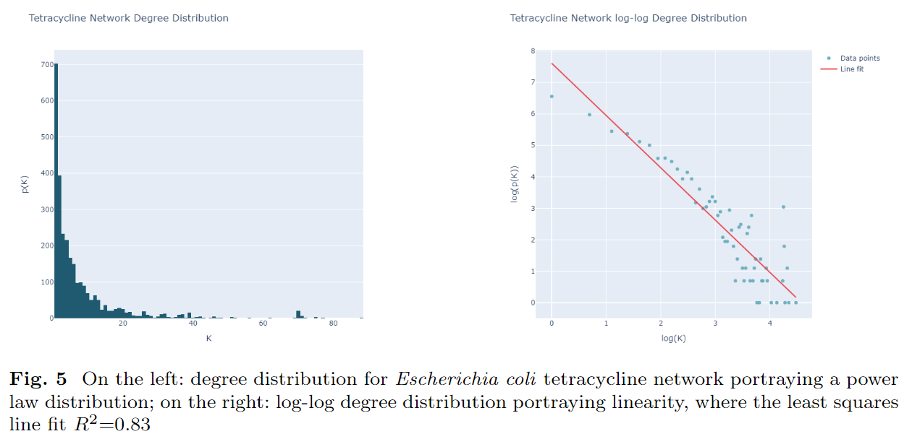

# Capstone project - Spring 2024

_This is a final year capstone project for the bachelors degree in Bioinformatics at LAU. The work was a literature based project conducted and presented during spring semester 2024. It was a comprehensive computational project that involved network science, data mining and statitical analysis, with a focus on genomics data, pangenomics and antimicrobial resistance. The repository is a public version of the project, with hidden commit history and results reported, aiming to showcase work done and computational methods used._

## Exploring Antimicrobial Resistance Mechanisms Through a Pangenome-Scale Epistatic Interactions Network

### Graphical Abstract



### Short Abstract
Antimicrobial resistance (AMR) is a major public health issue demanding combined interdisciplinary efforts to solve it. This project aims to portray the complex gene-interaction system driving AMR mechanisms by integrating pangenomics, machine learning, and network science. 
In this work, we aim to construct a reference-agnostic pangenomic network modelling epistatic interactions between alleles defined by their co-occurence. This network will be built on a resistance based topology to demonstrate gene interactions influencing AMR mechanisms.

**Keywords:** Antimicrobial Resistance (AMR), Network Science, Epistasis, Gene-Gene Interactions, Pangenome, Association, Machine Learning, Log-Odds Ratio, Allele Co-Occurrence

### Network overview

First visualization of the network modelled.





### Repo organization

```
.
├── CITATION.cff
├── LICENSE
├── data
│   ├── ARG
│   │   ├── Escherichia_coli_ARG.csv
│   │   ├── Escherichia_coli_ARG_sp_drugs.csv
│   │   └── Escherichia_coli_ARG_sp_drugs_products.csv
│   ├── DatasetS1.json
│   ├── Escherichia_coli_pheno_data.csv
│   ├── PATRIC_IDs
│   │   ├── Acinetobacter_baumannii.txt
│   │   ├── Campylobacter_coli.txt
│   │   ├── Campylobacter_jejuni.txt
│   │   ├── Enterobacter_cloacae.txt
│   │   ├── Enterococcus_faecium.txt
│   │   ├── Escherichia_coli.txt
│   │   ├── Klebsiella_pneumoniae.txt
│   │   ├── Neisseria_gonorrhoeae.txt
│   │   ├── Pseudomonas_aeruginosa.txt
│   │   ├── Salmonella_enterica.txt
│   │   ├── Staphylococcus_aureus.txt
│   │   └── Streptococcus_pneumoniae.txt
│   ├── SIR_readings.xlsx
│   ├── clusters
│   │   ├── Escherichia_coli_cluster_info.csv
│   │   └── Escherichia_coli_cluster_info_filtered.csv
│   ├── phenotypes
│   │   ├── {species*}_{antibiotic*}.csv
│   │   └── ...
│   ├── processed_phenotypes
│   │   ├── Escherichia_coli_{antibiotic*}.csv
│   │   └── ...
│   └── readme.md
├── figures
│   ├── Assoc_ARG_rank.png
│   ├── amoxicillin_dd.png
│   ├── ciprofloxacin_dd.png
│   ├── edge_attack.png
│   ├── graphical_abstract.png
│   ├── hairball.png
│   ├── log_log_amoxicillin.png
│   ├── log_log_tetracycline.png
│   ├── node_attack.png
│   ├── pan_annot_pie_charts_before_after.png
│   ├── phenotypic_drugs_distributions_Escherichia_coli.png
│   ├── streptomycin_net.png
│   └── tetracycline_dd.png
├── metadata
│   ├── E.coli_filter.txt
│   ├── Escherichia_coli/Escherichia_coli_{antibiotic*}.csv
│   ├── Escherichia_coli_pheno_data.csv
│   └── phenotypes
│       └── class_distribution
│           ├── Acinetobacter_baumannii/{antibiotic}.png
│           ├── Campylobacter_coli/*.png
│           ├── Campylobacter_jejuni/*.png
│           ├── Enterobacter_cloacae/*.png
│           ├── Enterococcus_faecium/*.png
│           ├── Escherichia_coli/*.png
│           ├── Klebsiella_pneumoniae/*.png
│           ├── Salmonella_enterica/*.png
│           ├── Staphylococcus_aureus/*.png
│           └── Streptococcus_pneumoniae/*.png
├── palette.json
├── readme.md
├── references.bib
├── requirements.txt
├── results
│   ├── ARGs_scores_trial.xlsx
│   ├── Escherichia_coli_all_ARGs.csv
│   ├── Escherichia_coli_all_ARGs_filtered_top100.csv
│   ├── Escherichia_coli_all_ARGs_filtered_top50.csv
│   ├── Escherichia_coli_amoxicillin
│   │   ├── Escherichia_coli_amoxicillin_ARGs_all.csv
│   │   ├── Escherichia_coli_amoxicillin_LOR.graphml
│   │   ├── Escherichia_coli_amoxicillin_LOR_annotated.graphml
│   │   ├── Escherichia_coli_amoxicillin_LOR_assoc.graphml
│   │   ├── Escherichia_coli_amoxicillin_LOR_signed.graphml
│   │   ├── Escherichia_coli_amoxicillin_LOR_signed_annotated.graphml
│   │   ├── Escherichia_coli_amoxicillin_associations.csv
│   │   ├── Escherichia_coli_amoxicillin_network_centralities_ARGs.csv
│   │   └── Escherichia_coli_amoxicillin_pairwise_ARGs.csv
│   ├── Escherichia_coli_ampicillin/*
│   ├── Escherichia_coli_cefalothin/*
│   ├── Escherichia_coli_ciprofloxacin/*
│   ├── Escherichia_coli_levofloxacin/*
│   ├── Escherichia_coli_streptomycin/*
│   ├── Escherichia_coli_sulfamethoxazole/*
│   ├── Escherichia_coli_tetracycline/*
│   ├── Escherichia_coli_trimethoprim/*
│   ├── SVM_cluster_info.csv
│   └── hairball_lcc_renamed.graphml
└── src
    ├── analysis
    │   ├── Escherichia_coli_amoxicillin_analysis.ipynb
    │   ├── Escherichia_coli_ampicillin_analysis.ipynb
    │   ├── Escherichia_coli_cefalothin_analysis.ipynb
    │   ├── Escherichia_coli_ciprofloxacin_analysis.ipynb
    │   ├── Escherichia_coli_hairball_analysis.ipynb
    │   ├── Escherichia_coli_levofloxacin_analysis.ipynb
    │   ├── Escherichia_coli_streptomycin_analysis.ipynb
    │   ├── Escherichia_coli_sulfamethoxazole_analysis.ipynb
    │   ├── Escherichia_coli_tetracycline_analysis.ipynb
    │   ├── Escherichia_coli_trimethoprim_analysis.ipynb
    │   ├── association.ipynb
    │   ├── community_detection.ipynb
    │   ├── general.ipynb
    │   ├── memoizing_dataframes.ipynb
    │   ├── phenotypes.ipynb
    │   ├── test.ipynb
    │   └── useful_cmds.sh
    ├── cluster_analysis.py
    ├── data_analysis.py
    ├── data_extraction
    │   ├── ARG_extraction.ipynb
    │   ├── extract_accessions.py
    │   ├── extract_all.sh
    │   ├── extract_genomes.sh
    │   └── extract_phenotypes.py
    ├── data_utils.py
    ├── gene_associations.py
    ├── model
    │   ├── 2way-ANOVA.ipynb
    │   ├── ANN.ipynb
    │   ├── LOR.ipynb
    │   ├── LOR.py
    │   ├── Logit.ipynb
    │   ├── MI.ipynb
    │   ├── SVM.ipynb
    │   ├── test_1.h5
    │   └── test_svm.ipynb
    ├── network_analysis.py
    ├── network_calculations.py
    ├── network_construction.py
    ├── network_inference_old
    │   ├── WGCN.ipynb
    │   ├── co_presence.ipynb
    │   ├── correlation copy.ipynb
    │   ├── correlation.ipynb
    │   ├── create_presence.ipynb
    │   └── test_corr.ipynb
    └── test
        ├── WGCN.R
        ├── WGNCA_presence.R
        ├── feature_interactions.R
        ├── lor.ipynb
        └── test.ipynb
```

_start date: 1/28/2024 5:23PM_  
_submission date: 5/17/2024_  
[*Mendeley paper collection*](./references.bib)